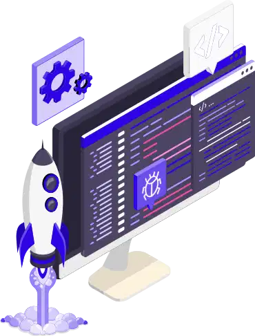

  

# Skillset ⚛️

Uma arquitetura clara, consistente e escalável para construir aplicações React e Next.js prontas para produção.

## Introdução

O ecossistema do React é enorme: existe uma biblioteca para praticamente qualquer necessidade. Isso é ótimo, mas também significa tomar dezenas de decisões antes de escrever a primeira tela. E como o React não impõe nenhuma arquitetura, cada projeto acaba organizado de um jeito, o que com o tempo gera código inconsistente, difícil de manter e cheio de soluções repetidas.

Este repositório reúne o jeito como eu construo aplicações React e Next.js: as ferramentas que escolho, como organizo as pastas, onde cada tipo de estado fica, como estruturo a camada de API e quais regras garantem tudo isso automaticamente. Cada decisão vem acompanhada do seu motivo, para que ela possa ser entendida, questionada e defendida.

O objetivo é ter um ponto de partida único para todos os meus projetos, para não recomeçar do zero a cada repositório nem reabrir as mesmas discussões.

## O que este guia busca

Não existe arquitetura perfeita para todos os casos, mas estes são os princípios que orientam cada decisão aqui:

- Fácil de começar
- Simples de entender e de manter
- A ferramenta certa para cada problema
- Limites claros entre as partes da aplicação
- O código flui em uma direção só: compartilhado → features → app
- Cada coisa fica perto de onde é usada
- Seguro por padrão
- Performático
- Acessível
- Escalável em tamanho de código e de equipe
- Problemas detectados o mais cedo possível, por ferramenta (TypeScript, lint, pré-commit), e não por memória
- Código legível vale mais que código curto

## Aviso

Este guia não é um template, um boilerplate nem um framework. É um conjunto de decisões opinativas sobre como fazer as coisas de uma certa forma.

As ferramentas citadas são as que uso hoje, não uma obrigação. O mais importante são os princípios por trás delas: se uma biblioteca for substituída por outra melhor, o raciocínio continua valendo. Alguns projetos vão pedir uma abordagem diferente, e tudo bem. O que não pode faltar é consistência dentro de cada projeto.

## Stack de referência

- **Base:** React ou Next.js (App Router) + TypeScript `strict`
- **Estilo:** Tailwind CSS + shadcn/ui
- **Dados e estado:** TanStack Query + Zustand
- **Formulários:** React Hook Form + Zod
- **Qualidade:** ESLint + Prettier + Husky + lint-staged
- **Testes:** Vitest + Testing Library + MSW

## Índice

1. [🗄️ Estrutura do projeto](docs/01-project-structure.md)
2. [⚙️ Padrões do projeto](docs/02-project-standards.md)
3. [🧱 Componentes e estilo](docs/03-components-and-styling.md)
4. [🗃️ Gerenciamento de estado](docs/04-state-management.md)
5. [📡 Camada de API](docs/05-api-layer.md)
6. [🔐 Segurança](docs/06-security.md)
7. [⚠️ Tratamento de erros](docs/07-error-handling.md)
8. [🚄 Performance](docs/08-performance.md)
9. [🧪 Testes](docs/09-testing.md)
10. [💬 Comentários](docs/10-comments.md)
11. [🖼️ Assets e imagens](docs/11-assets-and-images.md)
12. [🔧 Configuração do Next.js](docs/12-next-config.md)

## Uso com o Claude Code 🤖

O arquivo [`claude/CLAUDE.md`](claude/CLAUDE.md) é a versão resumida e objetiva destas regras, escrita para o Claude Code seguir.

1. Copie o arquivo para `~/.claude/CLAUDE.md`. A partir daí, as regras valem em todos os projetos.
2. Em cada repositório, mantenha um `CLAUDE.md` próprio apenas com o que é específico daquele projeto: domínio, rotas, modelo de dados e regras de negócio.
3. Ao mudar uma regra, atualize o capítulo correspondente e o `claude/CLAUDE.md` juntos.

## Contribuindo

Este é um guia pessoal, mas sugestões, correções e discussões são sempre bem-vindas:

1. Faça um fork do repositório
2. Crie uma branch: `git checkout -b minha-sugestao`
3. Faça as alterações
4. Use Conventional Commits nas mensagens (`docs: ...`, `fix: ...`)
5. Abra um Pull Request explicando o motivo da mudança

Se preferir só discutir uma ideia, abra uma issue.

## Inspiração

Este guia foi fortemente inspirado no [Bulletproof React](https://github.com/alan2207/bulletproof-react), de Alan Alickovic, e adaptado às minhas escolhas de ferramentas, ao Next.js com App Router e ao meu jeito de trabalhar.

## Licença

[MIT](LICENSE)
